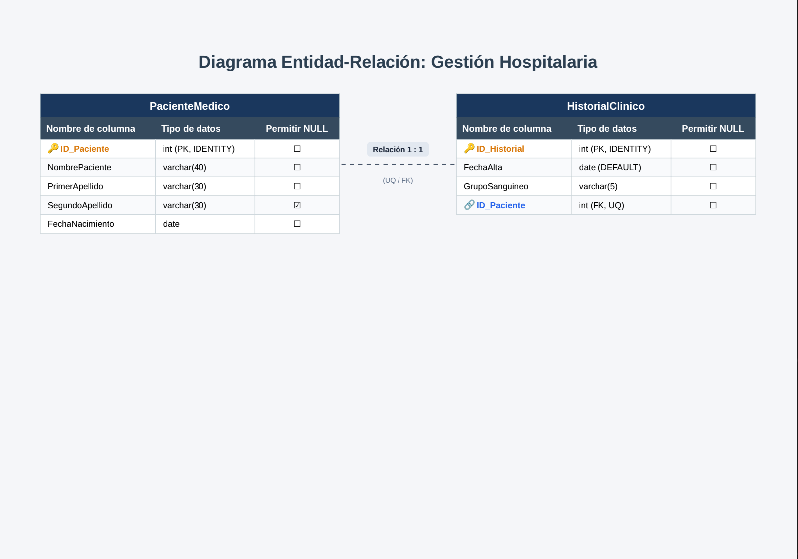

![Ejercicio 1]

CREATE DATABASE GestionHospitalaria;
GO

USE GestionHospitalaria;
GO

CREATE TABLE PacienteMedico (
    ID_Paciente INT IDENTITY(1,1) NOT NULL,
    NombrePaciente VARCHAR(40) NOT NULL,
    PrimerApellido VARCHAR(30) NOT NULL,
    SegundoApellido VARCHAR(30) NULL,
    FechaNacimiento DATE NOT NULL,
    CONSTRAINT PK_PacienteMedico PRIMARY KEY (ID_Paciente)
);
GO

-- 3. Tabla HISTORIALCLINICO (Entidad Relacionada 1:1)
CREATE TABLE HistorialClinico (
    ID_Historial INT IDENTITY(1,1) NOT NULL,
    FechaAlta DATE NOT NULL DEFAULT GETDATE(),
    GrupoSanguineo VARCHAR(5) NOT NULL,
    ID_Paciente INT NOT NULL,
    
    -- Llave Primaria
    CONSTRAINT PK_HistorialClinico PRIMARY KEY (ID_Historial),
    
    -- Llave Foránea hacia PacienteMedico
    CONSTRAINT FK_Historial_Paciente FOREIGN KEY (ID_Paciente) 
        REFERENCES PacienteMedico(ID_Paciente)
        ON DELETE CASCADE 
        ON UPDATE CASCADE,
        
    -- Restricción de unicidad para mantener relación 1 a 1
    CONSTRAINT UQ_Historial_Paciente UNIQUE (ID_Paciente)
);
GO