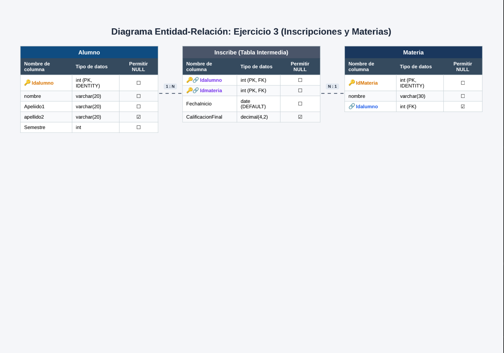

![Ejercicio 3]

CREATE DATABASE Ejercicio3;
GO

USE Ejercicio3;
Go

CREATE TABLE Alumno(
Idalumno INT IDENTITY (1,1) NOT NULL,
nombre VARCHAR (20) NOT NULL,
Apeliido1 VARCHAR (20) NOT NULL,
apellido2 VARCHAR (20) NULL,
Semestre INT NOT NULL,
CONSTRAINT PK_Alumno PRIMARY KEY (Idalumno)
);
GO
CREATE TABLE Materia(
IdMateria INT IDENTITY(1,1) NOT NULL,
nombre VARCHAR (30) NOT NULL,
Idalumno INT NULL,

CONSTRAINT PK_Materia PRIMARY KEY (IdMateria),
CONSTRAINT FK_Alumno FOREIGN KEY (Idalumno)
REFERENCES Alumno(Idalumno)
ON DELETE CASCADE
ON UPDATE CASCADE
);
GO

CREATE TABLE Inscribe(
Idalumno INT NOT NULL,
Idmateria INT NOT NULL,
FechaInicio DATE NOT NULL DEFAULT GETDATE(),
CalificacionFinal DECIMAL(4,2)NULL,

CONSTRAINT PK_Incribe PRIMARY KEY (Idalumno,Idmateria),
CONSTRAINT FK_Inscribe_Alumno FOREIGN KEY (Idalumno)
REFERENCES Alumno(Idalumno)
ON DELETE CASCADE
ON UPDATE CASCADE,
CONSTRAINT FK_Inscribe_Materia FOREIGN KEY (IdMateria)
REFERENCES Materia(IdMateria)
ON DELETE NO ACTION
ON UPDATE NO ACTION 
);
GO