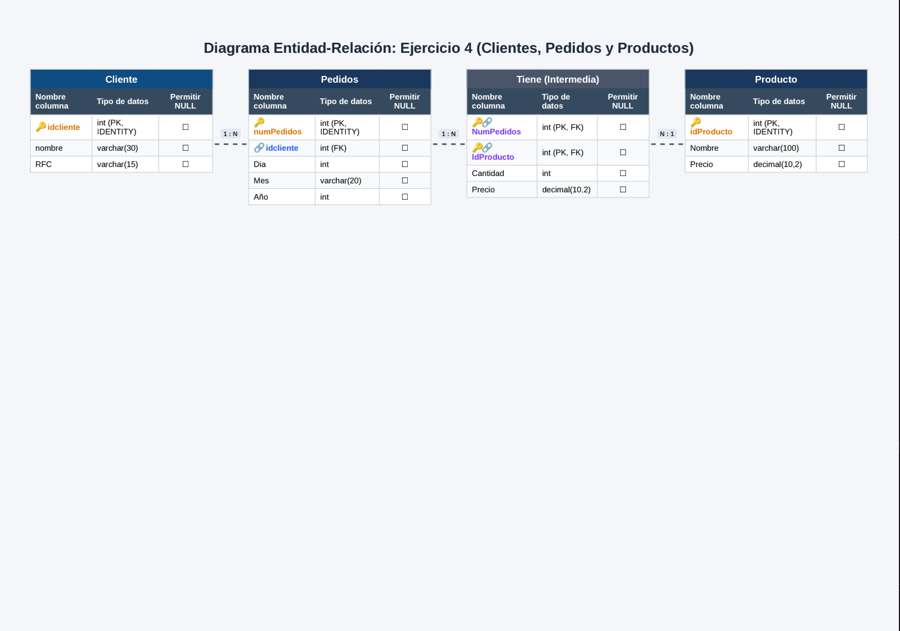

![Ejercicio 4] 

CREATE DATABASE Ejercicio4;
GO

USE Ejercicio4;
Go

CREATE TABLE Cliente(
idcliente INT IDENTITY (1,1)NOT NULL,
nombre VARCHAR (30) NOT NULL,
RFC VARCHAR (15) NOT NULL,
PRIMARY KEY (idcliente)
);
GO
CREATE TABLE Pedidos(
numPedidos INT IDENTITY(1,1) NOT NULL,
idcliente INT NOT NULL,
Dia INT NOT NULL,
Mes VARCHAR (20) NOT NULL,
Año INT NOT NULL,
PRIMARY KEY (numPedidos),
CONSTRAINT FK_pedidos_Cliente
FOREIGN KEY (idcliente)
REFERENCES Cliente (idCliente)
ON DELETE NO ACTION
ON UPDATE CASCADE
);
GO

CREATE TABLE Producto(
idProducto INT IDENTITY (1,1) NOT NULL,
Nombre VARCHAR(100) NOT NULL,
Precio DECIMAL(10,2) NOT NULL,
PRIMARY KEY (IdProducto)
);
GO

CREATE TABLE Tiene (
NumPedidos INT NOT NULL,
IdProducto INT NOT NULL,
Cantidad INT NOT NULL,
Precio DECIMAL(10,2) NOT NULL,
PRIMARY KEY (numpedidos,idproducto),
CONSTRAINT FK_Tiene_pedidos
FOREIGN KEY (numpedidos)
REFERENCES Pedidos(numpedidos)
ON DELETE CASCADE
ON UPDATE CASCADE,
CONSTRAINT FK_Tiene_producto
FOREIGN KEY (idproducto)
REFERENCES Producto(idproducto)
ON DELETE NO ACTION 
ON UPDATE CASCADE
);
GO