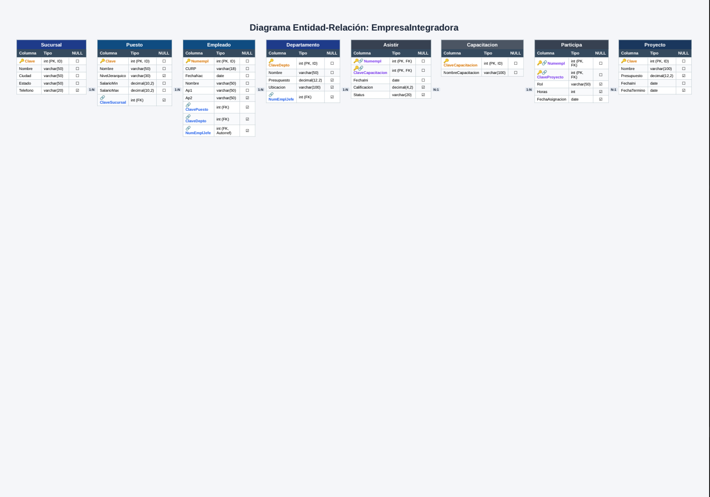

![Ejercicio 9]

CREATE DATABASE EmpresaIntegradora;
GO

USE EmpresaIntegradora;
GO

CREATE TABLE Sucursal (
    Clave INT IDENTITY(1,1),
    Nombre VARCHAR(50) NOT NULL,
    Ciudad VARCHAR(50) NOT NULL,
    Estado VARCHAR(50) NOT NULL,
    Telefono VARCHAR(20),
    PRIMARY KEY (Clave)
);
GO

CREATE TABLE Puesto (
    Clave INT IDENTITY(1,1),
    Nombre VARCHAR(50) NOT NULL,
    NivelJerarquico VARCHAR(30),
    SalarioMin DECIMAL(10,2) NOT NULL,
    SalarioMax DECIMAL(10,2) NOT NULL,
    ClaveSucursal INT NULL,
    PRIMARY KEY (Clave),
    CONSTRAINT FK_Puesto_Sucursal 
        FOREIGN KEY (ClaveSucursal) 
        REFERENCES Sucursal(Clave)
        ON DELETE NO ACTION ON UPDATE CASCADE
);
GO

CREATE TABLE Departamento (
    ClaveDepto INT IDENTITY(1,1),
    Nombre VARCHAR(50) NOT NULL,
    Presupuesto DECIMAL(12,2),
    Ubicacion VARCHAR(100),
    NumEmplJefe INT NULL, 
    PRIMARY KEY (ClaveDepto)
);
GO

CREATE TABLE Empleado (
    Numempl INT IDENTITY(1,1),
    CURP VARCHAR(18) NOT NULL,
    FechaNac DATE NOT NULL,
    Nombre VARCHAR(50) NOT NULL,
    Ap1 VARCHAR(50) NOT NULL,
    Ap2 VARCHAR(50),
    ClavePuesto INT NULL,  
    ClaveDepto INT NULL,    
    NumEmplJefe INT NULL,    
    PRIMARY KEY (Numempl),
    CONSTRAINT FK_Empleado_Puesto 
        FOREIGN KEY (ClavePuesto) 
        REFERENCES Puesto(Clave)
        ON DELETE NO ACTION ON UPDATE CASCADE,
    CONSTRAINT FK_Empleado_Departamento 
        FOREIGN KEY (ClaveDepto) 
        REFERENCES Departamento(ClaveDepto)
        ON DELETE NO ACTION ON UPDATE CASCADE
);
GO

CREATE TABLE Proyecto (
    Clave INT IDENTITY(1,1),
    Nombre VARCHAR(100) NOT NULL,
    Presupuesto DECIMAL(12,2),
    FechaIni DATE NOT NULL,
    FechaTermino DATE,
    PRIMARY KEY (Clave)
);
GO

CREATE TABLE Capacitacion (
    ClaveCapacitacion INT IDENTITY(1,1),
    NombreCapacitacion VARCHAR(100) NOT NULL,
    PRIMARY KEY (ClaveCapacitacion)
);
GO

CREATE TABLE Participa (
    Numempl INT NOT NULL,
    ClaveProyecto INT NOT NULL,
    Rol VARCHAR(50),
    Horas INT,
    FechaAsignacion DATE,
    PRIMARY KEY (Numempl, ClaveProyecto),
    CONSTRAINT FK_Participa_Empleado 
        FOREIGN KEY (Numempl) 
        REFERENCES Empleado(Numempl)
        ON DELETE CASCADE ON UPDATE CASCADE,
    CONSTRAINT FK_Participa_Proyecto 
        FOREIGN KEY (ClaveProyecto) 
        REFERENCES Proyecto(Clave)
        ON DELETE CASCADE ON UPDATE CASCADE
);
GO

CREATE TABLE Asistir (
    Numempl INT NOT NULL,
    ClaveCapacitacion INT NOT NULL,
    FechaIni DATE NOT NULL,
    Calificacion DECIMAL(4,2),
    Status VARCHAR(20),
    PRIMARY KEY (Numempl, ClaveCapacitacion),
    CONSTRAINT FK_Asistir_Empleado 
        FOREIGN KEY (Numempl) 
        REFERENCES Empleado(Numempl)
        ON DELETE CASCADE ON UPDATE CASCADE,
    CONSTRAINT FK_Asistir_Capacitacion 
        FOREIGN KEY (ClaveCapacitacion) 
        REFERENCES Capacitacion(ClaveCapacitacion)
        ON DELETE CASCADE ON UPDATE CASCADE
);
GO
ALTER TABLE Departamento 
ADD CONSTRAINT FK_Departamento_EmpleadoJefe 
FOREIGN KEY (NumEmplJefe) 
REFERENCES Empleado(Numempl);
GO

ALTER TABLE Empleado 
ADD CONSTRAINT FK_Empleado_Jefe 
FOREIGN KEY (NumEmplJefe) 
REFERENCES Empleado(Numempl);
GO